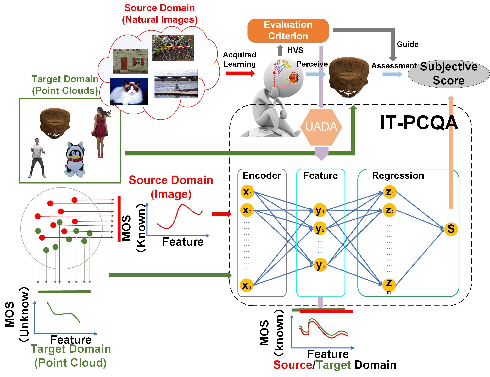
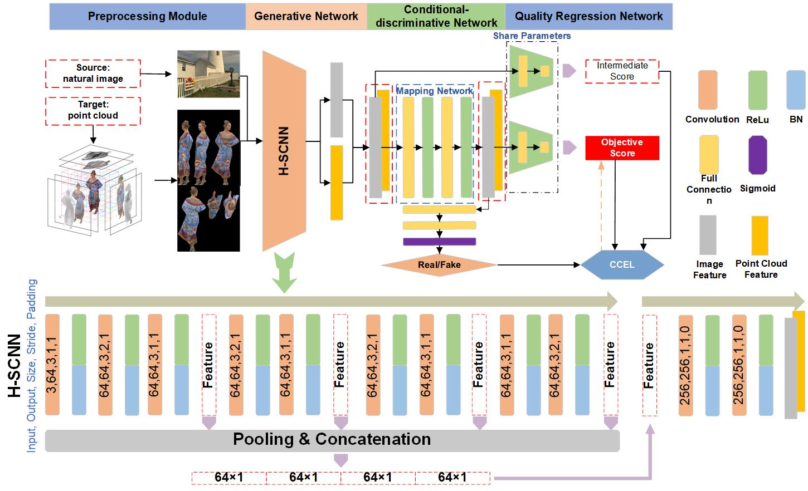
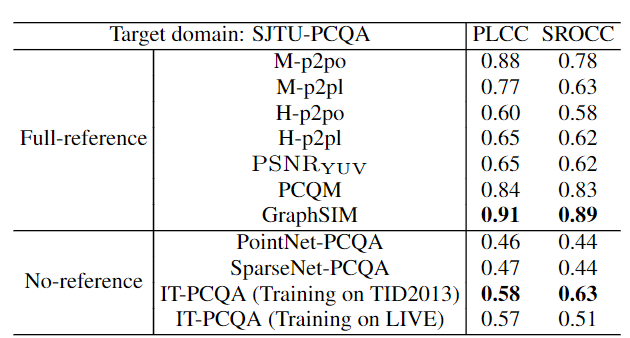
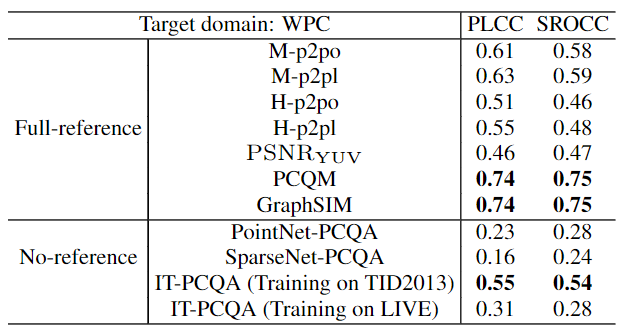

# IT-PCQA

Abstrat
-------
We present a novel no-reference quality assessment metric, the image transferred point cloud quality assessment (IT-PCQA), for 3D point clouds.  For quality assessment, deep neural network (DNN) has shown compelling performance on no-reference metric design. However, the most challenging issue for no-reference PCQA is that we lack large-scale subjective databases to drive robust networks. Our motivation is that the human visual system (HVS) is the decision-maker regardless of the type of media for quality assessment. Leveraging the rich subjective scores of the natural images, we can quest the evaluation criteria of human perception via DNN and transfer the capability of prediction to 3D point clouds. In particular, we treat natural images as the source domain and point clouds as the target domain, and infer point cloud quality via unsupervised adversarial domain adaptation. To extract effective latent features and minimize the domain discrepancy, we propose a hierarchical feature encoder and a conditional-discriminative network. Considering that the ultimate purpose is regressing objective score, we introduce a novel conditional cross entropy loss in the conditional-discriminative network to penalize the negative samples which hinder the convergence of the quality regression network. Experimental results show that the proposed method can achieve higher performance than traditional no-reference metrics, even comparable results with full-reference metrics. The proposed method also suggests the feasibility of assessing the quality of specific media content without the expensive and cumbersome subjective evaluations.

Framework
-----------

An illustration of our proposed IT-PCQA. It consists of four strongly related substeps. (a) Preprocessing module is used to generate multi-perspective images based on the point cloud sample. (b) A generative network is used to extract hierarchical features from both source and target domains. (c) The conditional-discriminative network is in a position to connect feature generative network and quality regression network, in which the features are refined to match domain shift and liable to regression network produce accurate results. Specifically, the size of FCs in mapping network are both 256×256, and the FCs in front of Sigmoid are 256×64 and 64×1. (d) Quality regression network is the endgame of the whole model, which achieves the prediction of quality. Specifically, the two FCs with 256×128 and 128×1.

Results
-----------
1. results on SJTU-PCQA

2. results on WPC

Usage
-----------

demo.py will load the trained model and compute PLCC and SROCC on the testing set.  

train.py is the main program. The explanations of some parameters are as below: 

parser.add_argument('--batch_size', type=int, default=16,
                        help='input batch size for training')  
parser.add_argument('--test_batch_size', type=int, default=16,
					help='input batch size for testing')  
parser.add_argument('--epochs', type=int, default=50, metavar='N',
					help='number of epochs to train')  
parser.add_argument('--lr', type=float, default=0.003, metavar='LR')  
parser.add_argument('--momentum', type=float, default=0.9, metavar='M',
					help='SGD momentum')  
parser.add_argument('--slabelscale', type=float, default=9.0,
					help='Maximum value of labels for source domain')  
parser.add_argument('--tlabelscale', type=float, default=9.0,
					help='Maximum value of labels for target domain') 
					
To load the existing model, the related parameter is:  
parser.add_argument('--resume', type=str, default=None,
                  help='checkpoints/model_15.pth') 
ps: model_15.pth is trained on SJTU-PCQA with TID2013.

Scripts
-----------
Run scripts/projection_main.m to project the point cloud into 2D images on 6 perpendicular planes.  
Run scripts/Image_compose.py to splice 6 projection images together to form a multi-perspective image.
					
Bibtex
-----------
If you use this code please cite the paper   

    "Qi Yang, Yipeng Liu, Siheng Chen, Yiling Xu, Jun Sun, "No-Reference Point Cloud Quality Assessment via Domain Adaptation," in CVPR, 2022."  
     
@InProceedings{yang2022ITPCQA,  
author = {Qi Yang and Yipeng Liu and Siheng Chen and Yiling Xu and Jun Sun},  
title = {No-Reference Point Cloud Quality Assessment via Domain Adaptation},  
booktitle = {Proceedings of the IEEE Conference on Computer Vision and Pattern Recognition (CVPR)},  
year = {2022}  
}
  					
